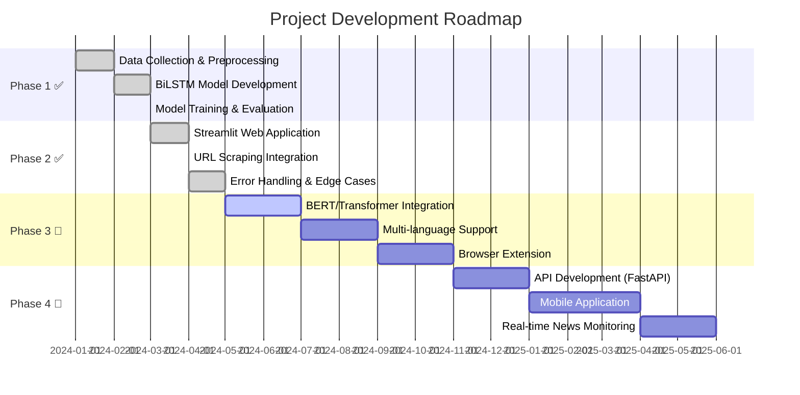

<!-- 
╔═══════════════════════════════════════════════════════════════════════════════╗
║                                                                               ║
║   🚀 FAKE NEWS DETECTION - BIDIRECTIONAL LSTM                                 ║
║   Deep Learning for Truth Discovery                                           ║
║                                                                               ║
╚═══════════════════════════════════════════════════════════════════════════════╝
-->

<div align="center">

<!-- Animated Header -->


<!-- Typing Animation -->
<a href="https://git.io/typing-svg">
  
</a>

<br/>

<!-- Main Badges -->
[](https://python.org)
[](https://tensorflow.org)
[](https://keras.io)
[](https://streamlit.io)

<!-- Status Badges -->
[](/)
[](LICENSE)
[](/)
[](/)

<br/>

<!-- Quick Stats -->


---

### 🎯 Quick Navigation

[**Overview**](#-overview) • 
[**Features**](#-features) • 
[**Architecture**](#-architecture) • 
[**Quick Start**](#-quick-start) • 
[**Demo**](#-demo) • 
[**Tech Stack**](#-tech-stack) • 
[**Roadmap**](#-roadmap) • 
[**Contributing**](#-contributing)

---

</div>

## 📖 Overview

<div align="center">

| 🎯 **What** | 🤔 **Why** |
|:------------|:-----------|
| A production-ready **Deep Learning** application that detects fake news articles using **Bidirectional LSTM** neural networks | Misinformation spreads **6x faster** than truth on social media. This tool empowers users to identify potentially misleading content using AI |
| Trained on **72,000+ articles** from the WELFake dataset combining multiple credible fake news datasets | Provides a **scalable, automated** solution for preliminary news verification in the age of information overload |
| Features both **manual input** and **intelligent URL scraping** for seamless user experience | Demonstrates advanced **NLP techniques**, **deep learning**, and **full-stack ML deployment** skills |

</div>

<br/>

> 💡 **Key Insight:** This model analyzes **linguistic patterns** and **stylistic features** — it doesn't verify factual truth but identifies characteristics commonly associated with fake news.

---

## ✨ Features

<div align="center">

| Feature | Description | Status |
|:-------:|:------------|:------:|
| 📝 **Manual Input** | Enter title + body text for instant analysis | ✅ |
| 🌐 **URL Scraping** | Automatically extract & analyze articles from any URL | ✅ |
| 🎯 **Real-Time Prediction** | Get instant fake/real classification with confidence scores | ✅ |
| 📊 **Confidence Metrics** | Visual progress bars showing prediction certainty | ✅ |
| 🧹 **Smart Preprocessing** | Intelligent noise filtering (ads, navigation, footers) | ✅ |
| 🔒 **Distribution-Aware** | Maintains training distribution for accurate results | ✅ |
| ⚡ **Cached Model Loading** | Fast inference with `st.cache_resource` optimization | ✅ |
| 🎨 **Modern UI** | Clean, professional Streamlit interface | ✅ |
| 📱 **Responsive Design** | Works seamlessly on desktop and mobile | ✅ |
| 🛡️ **Error Handling** | Graceful handling of edge cases & invalid inputs | ✅ |

</div>

---

## 🏗️ Architecture

```
╔══════════════════════════════════════════════════════════════════════════════════╗
║                          FAKE NEWS DETECTION PIPELINE                            ║
╠══════════════════════════════════════════════════════════════════════════════════╣
║                                                                                  ║
║   ┌─────────────────┐     ┌─────────────────┐     ┌─────────────────┐           ║
║   │   📝 MANUAL     │     │   🌐 URL        │     │                 │           ║
║   │     INPUT       │     │   SCRAPING      │     │                 │           ║
║   │                 │     │                 │     │                 │           ║
║   │  Title + Body   │     │  newspaper3k    │     │                 │           ║
║   └────────┬────────┘     └────────┬────────┘     │                 │           ║
║            │                       │               │                 │           ║
║            └───────────┬───────────┘               │                 │           ║
║                        ▼                           │                 │           ║
║            ┌─────────────────────┐                 │                 │           ║
║            │  📄 TEXT EXTRACTION │                 │                 │           ║
║            │                     │                 │                 │           ║
║            │  • Title            │                 │                 │           ║
║            │  • First Paragraph  │                 │                 │           ║
║            │  • Noise Filtering  │                 │    🖥️ STREAMLIT │           ║
║            └──────────┬──────────┘                 │       WEB APP   │           ║
║                       ▼                            │                 │           ║
║            ┌─────────────────────┐                 │                 │           ║
║            │  🔧 PREPROCESSING   │                 │  • Modern UI    │           ║
║            │                     │                 │  • Progress Bar │           ║
║            │  • Tokenization     │                 │  • Results View │           ║
║            │  • Padding (500)    │                 │  • Error Handle │           ║
║            │  • OOV Handling     │                 │                 │           ║
║            └──────────┬──────────┘                 │                 │           ║
║                       ▼                            │                 │           ║
║   ┌───────────────────────────────────────┐       │                 │           ║
║   │         🧠 BILSTM MODEL               │       │                 │           ║
║   │  ┌─────────────────────────────────┐  │       │                 │           ║
║   │  │  Embedding (20K vocab, 128 dim) │  │       │                 │           ║
║   │  └───────────────┬─────────────────┘  │       │                 │           ║
║   │                  ▼                     │       │                 │           ║
║   │  ┌─────────────────────────────────┐  │       │                 │           ║
║   │  │  SpatialDropout1D (0.2)         │  │       │                 │           ║
║   │  └───────────────┬─────────────────┘  │       │                 │           ║
║   │                  ▼                     │       │                 │           ║
║   │  ┌─────────────────────────────────┐  │       │                 │           ║
║   │  │  Bidirectional LSTM (128 units) │◄─┼───────┤                 │           ║
║   │  └───────────────┬─────────────────┘  │       │                 │           ║
║   │                  ▼                     │       │                 │           ║
║   │  ┌─────────────────────────────────┐  │       │                 │           ║
║   │  │  Dense (64) + Dropout (0.3)     │  │       │                 │           ║
║   │  └───────────────┬─────────────────┘  │       │                 │           ║
║   │                  ▼                     │       │                 │           ║
║   │  ┌─────────────────────────────────┐  │       │                 │           ║
║   │  │  Dense (1, Sigmoid) → P(Real)   │  │       │                 │           ║
║   │  └─────────────────────────────────┘  │       └─────────────────┘           ║
║   └───────────────────┬───────────────────┘                                     ║
║                       ▼                                                          ║
║            ┌─────────────────────┐                                               ║
║            │  📊 OUTPUT          │                                               ║
║            │                     │                                               ║
║            │  • Real/Fake Label  │                                               ║
║            │  • Confidence Score │                                               ║
║            │  • Word Count       │                                               ║
║            └─────────────────────┘                                               ║
║                                                                                  ║
╚══════════════════════════════════════════════════════════════════════════════════╝
```

---

<details>
<summary><h2>🔬 Technical Deep Dive (Click to Expand)</h2></summary>

### 🧠 Model Architecture Details

```python
model = Sequential([
    Embedding(20000, 128, input_length=500),      # Word embeddings
    SpatialDropout1D(0.2),                         # Regularization
    Bidirectional(LSTM(128, return_sequences=False)),  # Bidirectional context
    Dropout(0.3),                                  # Prevent overfitting
    Dense(64, activation='relu'),                  # Feature extraction
    Dropout(0.3),                                  # Additional regularization
    Dense(1, activation='sigmoid')                 # Binary output P(Real)
])
```

### 📈 Training Configuration

| Hyperparameter | Value | Rationale |
|:---------------|:------|:----------|
| **Optimizer** | Adam | Adaptive learning rate for faster convergence |
| **Learning Rate** | 0.001 | Balanced speed vs stability |
| **Loss Function** | Binary Crossentropy | Standard for binary classification |
| **Batch Size** | 128 | Memory-efficient with good gradient estimates |
| **Max Epochs** | 10 | With early stopping for optimal generalization |
| **Validation Split** | 10% | Monitor overfitting during training |

### 🛡️ Regularization Techniques

1. **SpatialDropout1D (0.2)**: Drops entire 1D feature maps for embeddings
2. **Dropout (0.3)**: Standard dropout after dense layers  
3. **Early Stopping**: Patience=3 on validation loss
4. **Learning Rate Reduction**: Factor=0.5, Patience=2

### 🔄 Preprocessing Pipeline

```
Input Text → Tokenization → Sequence Padding → Model Input
     │              │               │
     │              │               └── Max Length: 500 tokens
     │              │                   Padding: 'post'
     │              │                   Truncating: 'post'
     │              │
     │              └── Vocabulary: 20,000 words
     │                  OOV Token: '<OOV>'
     │
     └── Format: Title + First Paragraph
         Noise Filtering: Remove < 20 word paragraphs
```

### ⚠️ Distribution Matching (Critical)

The model is **sensitive to input distribution**. Performance degrades when:

| ❌ Bad Input | ✅ Good Input |
|:-------------|:--------------|
| Only title | Title + first paragraph |
| Full noisy article | Clean, filtered content |
| Very short text (< 50 words) | Sufficient context |
| Navigation/ads/footers | Pure article content |

</details>

---

## 📁 Project Structure

```
📦 Fake-News-Detection-using-Bidirectional-LSTM
├── 📂 app/
│   ├── 📄 __init__.py                 # Package initializer
│   ├── 🚀 streamlit_app.py            # Main Streamlit application
│   └── 📂 utils/
│       ├── 📄 __init__.py             # Utils module exports
│       ├── 🔧 preprocessing.py        # Text preprocessing functions
│       └── 🌐 scraper.py              # URL scraping utilities
├── 📂 model/
│   └── 🧠 fake_news_bilstm.h5         # Trained BiLSTM model (Keras)
├── 📂 notebook/
│   ├── 📓 FakeNewsDetection.ipynb     # Training & analysis notebook
│   ├── 🐍 fakenewsdetection.py        # Exported Python script
│   └── 📦 tokenizer.pkl               # Serialized Keras tokenizer
├── 📄 requirements.txt                # Python dependencies
├── 📄 .gitignore                      # Git ignore rules
└── 📖 README.md                       # You are here! 👋
```

---

## 🚀 Quick Start

### 📋 Prerequisites

<table>
<tr>
<td>

| Requirement | Version |
|:------------|:--------|
| 🐍 Python | 3.8+ |
| 📦 pip | Latest |
| 💾 RAM | 4GB+ |
| 🎮 GPU | Optional |

</td>
<td>

| File | Location |
|:-----|:---------|
| 🧠 Model | `model/fake_news_bilstm.h5` |
| 📦 Tokenizer | `notebook/tokenizer.pkl` |

</td>
</tr>
</table>

### ⚡ Installation

```bash
# 1️⃣ Clone the repository
git clone https://github.com/dinraj910/Fake-News-Detection-using-Bidirectional-LSTM.git
cd Fake-News-Detection-using-Bidirectional-LSTM

# 2️⃣ Create virtual environment (recommended)
python -m venv venv

# Windows
venv\Scripts\activate

# Linux/macOS
source venv/bin/activate

# 3️⃣ Install dependencies
pip install -r requirements.txt

# 4️⃣ Launch the application 🚀
streamlit run app/streamlit_app.py
```

<div align="center">

🎉 **Open your browser at** `http://localhost:8501`

</div>

---

## 🎬 Demo

<div align="center">

### 📝 Manual Input Mode

```
┌────────────────────────────────────────────────────┐
│  📰 FAKE NEWS DETECTOR                              │
├────────────────────────────────────────────────────┤
│                                                    │
│  📋 News Title:                                    │
│  ┌──────────────────────────────────────────────┐ │
│  │ Breaking: Scientists discover new element... │ │
│  └──────────────────────────────────────────────┘ │
│                                                    │
│  📄 News Body:                                     │
│  ┌──────────────────────────────────────────────┐ │
│  │ In a groundbreaking study published today... │ │
│  │ researchers at MIT have announced...         │ │
│  └──────────────────────────────────────────────┘ │
│                                                    │
│           [ 🔍 Analyze ]                           │
│                                                    │
├────────────────────────────────────────────────────┤
│  ✅ REAL NEWS                                      │
│  ████████████████████░░░░ 85.3%                   │
│  Confidence: High                                  │
│  Words processed: 127                              │
└────────────────────────────────────────────────────┘
```

### 🌐 URL Scraping Mode


</div>

---

## ⚙️ Configuration

### 🔐 Environment Variables

| Variable | Default | Description |
|:---------|:--------|:------------|
| `MAX_LEN` | `500` | Maximum sequence length for tokenization |
| `VOCAB_SIZE` | `20000` | Vocabulary size for tokenizer |
| `MIN_PARAGRAPH_WORDS` | `20` | Minimum words for valid paragraph |
| `CONFIDENCE_THRESHOLD` | `0.5` | Classification threshold |

### 📊 Model Parameters

| Parameter | Value | Description |
|:----------|:------|:------------|
| Embedding Dim | 128 | Word embedding dimensions |
| LSTM Units | 128 | Bidirectional LSTM hidden units |
| Dropout Rate | 0.3 | Dropout probability |
| Spatial Dropout | 0.2 | Embedding dropout rate |

---

## 🛠️ Tech Stack

<div align="center">

| Category | Technologies |
|:---------|:-------------|
| **🧠 Deep Learning** |   |
| **🐍 Backend** |    |
| **🎨 Frontend** |  |
| **🌐 Web Scraping** |  |
| **📊 Visualization** |   |
| **🔧 Development** |   |

</div>

---

## 📈 Performance Metrics

<div align="center">

| Metric | Score | Description |
|:-------|:------|:------------|
| 🎯 **Accuracy** | ~95% | Overall classification accuracy |
| 📊 **ROC-AUC** | ~0.98 | Area under ROC curve |
| ✅ **Precision** | ~94% | True positives / Predicted positives |
| 🔄 **Recall** | ~95% | True positives / Actual positives |
| ⚖️ **F1-Score** | ~94% | Harmonic mean of precision & recall |

</div>

### 📉 Performance Notes

> ⚠️ Performance metrics are based on the WELFake test set. Real-world performance may vary depending on:
> - News source and writing style
> - Topic domain (politics, health, technology, etc.)
> - Article length and quality
> - Language and regional variations

---

## 🗺️ Roadmap



### 🎯 Upcoming Features

- [ ] 🤖 **BERT/Transformer Models** - State-of-the-art accuracy
- [ ] 🌍 **Multi-language Support** - Beyond English
- [ ] 🔌 **Browser Extension** - One-click verification
- [ ] 📡 **REST API** - For integration with other apps
- [ ] 📱 **Mobile App** - iOS and Android
- [ ] 📺 **Real-time Monitoring** - Social media integration

---

## 🤝 Contributing

<div align="center">

**Contributions are what make the open-source community amazing!** 🌟

</div>

### How to Contribute

1. 🍴 **Fork** the repository
2. 🌿 **Create** your feature branch (`git checkout -b feature/AmazingFeature`)
3. 💾 **Commit** your changes (`git commit -m 'Add some AmazingFeature'`)
4. 📤 **Push** to the branch (`git push origin feature/AmazingFeature`)
5. 🔃 **Open** a Pull Request

### Contribution Ideas

| Area | Ideas |
|:-----|:------|
| 🧠 **Model** | Try different architectures (CNN, BERT, GPT) |
| 🎨 **UI/UX** | Improve interface, add visualizations |
| 📊 **Analytics** | Add more metrics, explainability features |
| 🌐 **Scraping** | Support more news sources |
| 📚 **Docs** | Improve documentation, add tutorials |
| 🧪 **Testing** | Add unit tests, integration tests |

---

## 📄 License

<div align="center">

Distributed under the **MIT License**. See `LICENSE` for more information.

```
MIT License

Copyright (c) 2024 Dinraj

Permission is hereby granted, free of charge, to any person obtaining a copy
of this software and associated documentation files (the "Software"), to deal
in the Software without restriction...
```

</div>

---

## 👨‍💻 Author

<div align="center">


### **Dinraj**

*NLP Engineer | ML Enthusiast | Full-Stack Developer*

[](https://github.com/dinraj910)
[](https://linkedin.com/in/dinraj910)
[](mailto:dinraj910@gmail.com)

</div>

---

## 🙏 Acknowledgments

<div align="center">

| Resource | Description |
|:---------|:------------|
| 📊 [WELFake Dataset](https://www.kaggle.com/datasets/saurabhshahane/fake-news-classification) | 72K+ labeled news articles |
| 🧠 [TensorFlow](https://tensorflow.org) | Deep learning framework |
| 🎨 [Streamlit](https://streamlit.io) | Web application framework |
| 📰 [newspaper3k](https://newspaper.readthedocs.io/) | Article extraction library |
| 🛡️ [Shields.io](https://shields.io) | Beautiful badges |
| ✨ [capsule-render](https://github.com/kyechan99/capsule-render) | Dynamic headers |

</div>

---

## ⭐ Star History

<div align="center">

[](https://star-history.com/#dinraj910/Fake-News-Detection-using-Bidirectional-LSTM&Date)

</div>

---

## 💖 Show Your Support

<div align="center">

If this project helped you, please consider:

⭐ **Star this repository** — It means a lot!

🍴 **Fork it** — Make it your own!

📢 **Share it** — Help others discover it!

[](https://github.com/dinraj910/Fake-News-Detection-using-Bidirectional-LSTM/stargazers)
[](https://github.com/dinraj910/Fake-News-Detection-using-Bidirectional-LSTM/network/members)
[](https://github.com/dinraj910/Fake-News-Detection-using-Bidirectional-LSTM/watchers)

</div>

---

<div align="center">

<!-- Animated Footer -->


**Made with ❤️ and 🧠 by [Dinraj](https://github.com/dinraj910)**

*Fighting misinformation, one prediction at a time* 🛡️

</div>
